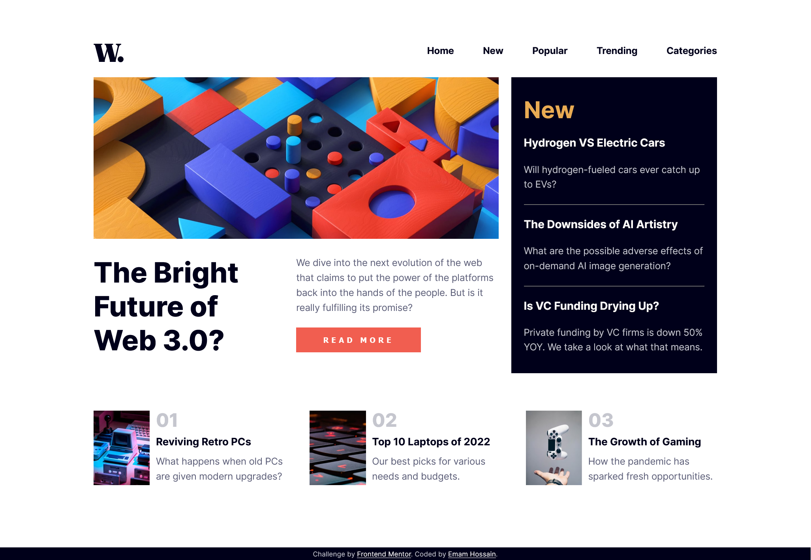

# Frontend Mentor - News homepage solution

This is a solution to the [News homepage challenge on Frontend Mentor](https://www.frontendmentor.io/challenges/news-homepage-H6SWTa1MFl). Frontend Mentor challenges help you improve your coding skills by building realistic projects.

## Table of contents

- [Overview](#overview)
  - [The challenge](#the-challenge)
  - [Screenshot](#screenshot)
  - [Links](#links)
- [My process](#my-process)
  - [Built with](#built-with)
  - [What I learned](#what-i-learned)
  - [Useful resources](#useful-resources)
- [Author](#author)

## Overview

### The challenge

Users should be able to:

- View the optimal layout for the interface depending on their device's screen size
- See hover and focus states for all interactive elements on the page

### Screenshot



### Links

- Solution URL: [Add solution URL here](https://github.com/EmamHossainEmo/news-homepage-frontend-mentor-challenge.git)
- Live Site URL: [Add live site URL here](https://your-live-site-url.com)

## My process

### Built with

- Semantic HTML5 markup
- CSS custom properties
- Flexbox
- CSS Grid
- Mobile-first workflow

### What I learned

I learned a lot from designing my first navigation bar. Toggling the nav bar, in particular, was a valuable experience that allowed me to grasp the importance of user-friendly navigation. Additionally, I gained significant insight into responsive design, ensuring that the navigation bar adapts seamlessly to different screen sizes and devices.

Really like this simple function:

```js
function toggleNav() {
  navEl.classList.toggle("hide-nav");
}
```

### Useful resources

- [MDN Web Docs](https://developer.mozilla.org/en-US)
- [W3 Schools](https://www.w3schools.com)

## Author

- Frontend Mentor - [@EmamHossainEmo](https://www.frontendmentor.io/profile/EmamHossainEmo)
- Twitter - [@imam9939](https://twitter.com/imam9939)
